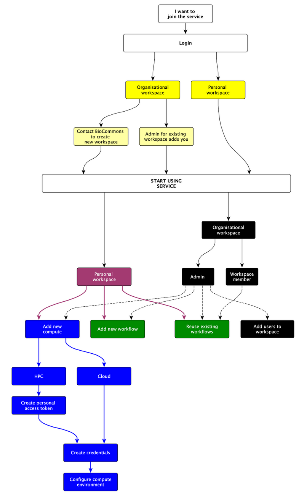

There are currently two ways in which you can make use of the Nextflow Tower service during the pilot project:

## 1. Organisation workspace

A collaborative workspace where multiple users can work together and share resources such as compute environments and workflows. More details are available via the [Tower documentation at this link](https://help.tower.nf/latest/orgs-and-teams/workspace-management/).

The Australian BioCommons supports this model by providing advice and expertise that facilitates onboarding and use of organisation workspaces.

Please note:
- Each organisation/group is responsible for the long-term management and maintenance of its workspaces. Organisation workspaces are private and their resources are only accessible by the workspace users and the owners of the Australian BioCommons organisation.

- Organisation workspaces can be shared where all their resources become accessible to all users within the Australian BioCommons organisation on Tower. This kind of workspace can be very effective for sharing workflows that benefit the broader bioinformatics community. Check the Tower documentation to understand more about [shared worksapces](https://help.tower.nf/latest/orgs-and-teams/shared-workspaces/).

> **Important:**
> Please [contacting us](contact_us) if you plan to apply for an organisation workspace.

> **Organisaion workspace Support:**
> Organisation workspace support: Read about the [available support](/main/join_us.md) for this access model here.

## 2. Personal workspace

Any Australian researcher can access  [the Australian BioCommons Tower Service](http://tower.services.biocommons.org.au/) during the pilot phase and use their own personal workspace. Please refer to the [Tower documentation](https://help.tower.nf/latest/getting-started/workspace/).

Please note:
- Personal workspaces are only accessible by their owners
- The Australian BioCommons does not provide direct support for this type of workspace
- Users are responsible for setting up, managing and maintaining their personal workspaces.

> **Important:**
> To access a personal workspace visit the accessing the service section.

# The process of joining and utilising the Australian BioCommons Nextflow Tower Service

 

 