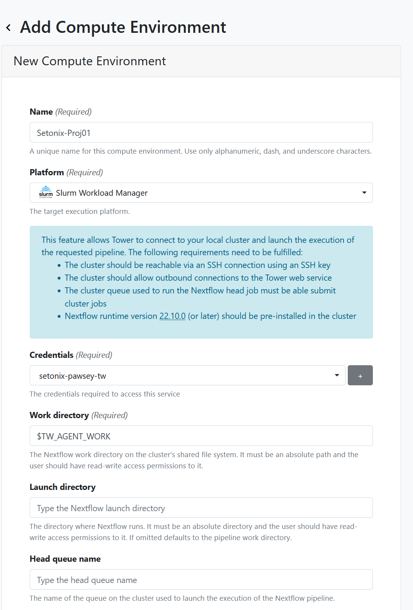

1. Navigate back to the launchpad page for the workspace where you want to add a compute environment. 
2. Select the `Compute Environments` tab in the top navigation bar.
3. Select `Add Compute Environment` button.
4. Give the environment a name 
   - Make it as descriptive as you like
   - For HPC you may wish to configure different compute environments for different project codes, so you could include this in the environment name to easily identify it. For example, specify the name of the HPC and the relevant project code.

5. Select a platform 
   - This will depend on which infrastructure you are running and what workload managers are available there.
   - Examples: For Setonix `SLURM`, for Gadi `PBSpro`.
6. Select work directory 
   - This can remain as `$TW_AGENT_WORK` or specify your own.
   - Leave the `launch directory` field empty.
   - Provide the launch and compute queue (as available on the HPC).

We recommend using a queue with long wall time for the launch queue as this is dedicated to the nextflow main process that should run for the whole time of the pipeline execution.

Compute queue will be used for the tasks of the pipeline, so we recommend using the default queue on the HPC.

The compute queue can be reconfigured during the execution through the pipeline configuration options.

7. Select staging options. Under `Pre-run script`:
   - Here you can provide all commands to be executed on the HPC before launching the pipeline, including module loading. 
   - Usually you will need to load `Nextflow`, `singularity`, `conda`, `awscli`, if any of them will be used.
8. Specify advanced options 
   - Under head job submit options add project specific and queue data. This configuration is for the job that runs the main nextflow process.
   - It is recommended to use 2 cpus and 8 GB memory for this job.
   - Apply head job submit options to compute jobs to ensure your account details get passed on.
9. Click on `Add` and the compute environment will be created.

