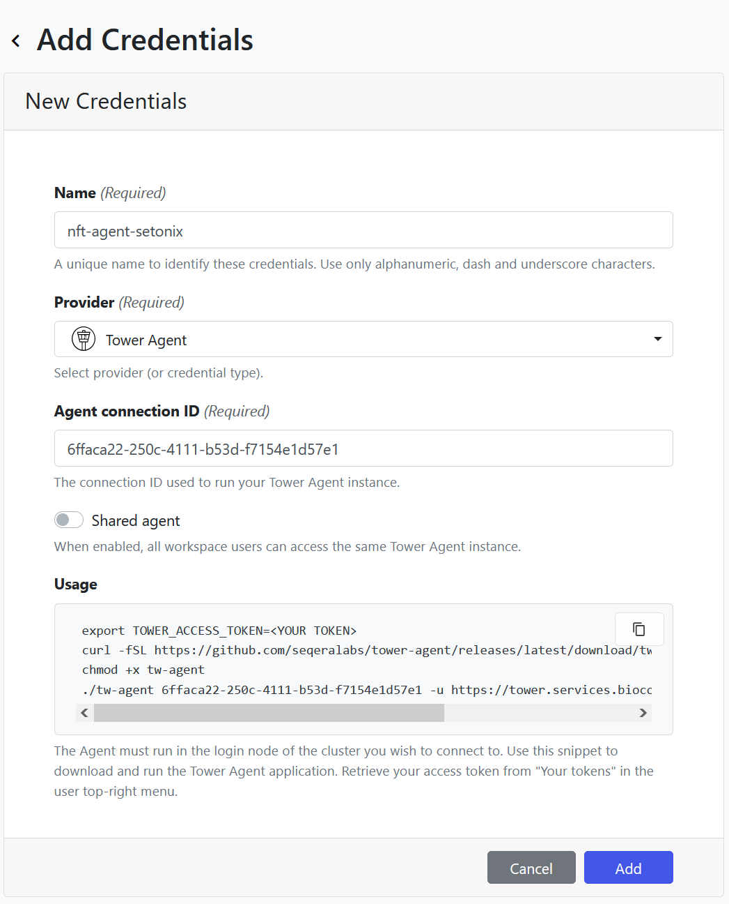

[Tower agent](https://help.tower.nf/latest/agent/) is software that runs on the HPC and communicates with the Tower API to perform all the tasks needed on the HPC, including launching a pipeline and monitoring its execution. 

For an admin to create a Tower Agent credential, follow these steps:

1. Navigate to the workspace you want to add credentials to, then click on the `Credentials` tab. 
2. Click on the `Add Credentials` button under `Credentials` to create a shared `Agent connection ID` for the Tower Agent. 
3. A wizard interface will appear, with some scripts in the `Usage` box and fields to complete.

4. Give your credential a descriptive name. This is working at the compute infrastructure level, so we recommend creating different credentials for different environments.
5. Keep `Shared agent` disabled. Check [Shared agent section](shared-agent) for more details on this. 
6. Before adding the credential you will need to run the agent on the compute infrastructure. To do this:
   1. Keep the Agent interface open. 
   2. Log in to infrastructure (i.e. the HPC). 
   3. In theory, you can run the agent from anywhere on the HPC, but you can see best practices for some recommendations. 
   4. Copy the usage script from the Agent interface to any text editor and edit the Access token to provide your own token created above, and provide the path to the work directory for the Agent.
   5. The work directory for the Agent (provided as a parameter in the command) must exist before running the Agent. 
   6. Run the edited script relevant to your infrastructure (`PBS` or `SLURM`) bash. 
   7. This script will download the Tower Agent script to the current work directory on the HPC and make it executable.
   8. Then, it runs the Agent by providing the connection id and access token.
   9. You can see the Agent running on the terminal. Keep it running.
   10. Back in the Tower interface, click `Add` to save your credential.

The steps above will help to create the credentials and understand the Agent's parameters and how it runs. In practice, this can be better optimised by having all scripts and tokens in config files and bash scripts. 

See best practice recommendations. 

The procedure is also described in the Tower documentation [Quick Start](https://help.tower.nf/latest/agent/#quickstart).





