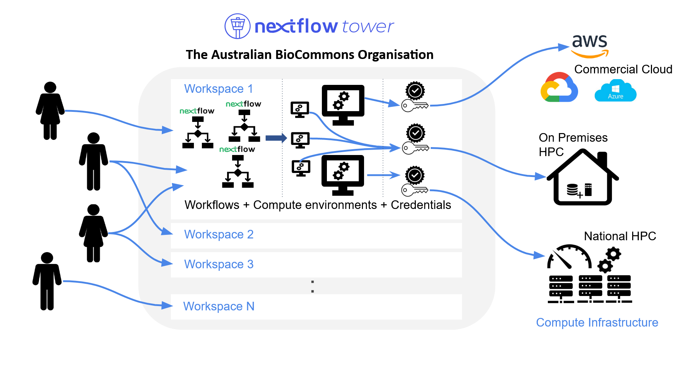

## About these user guides

## The structure of the BioCommons Organization on Nextflow Tower Service

The figure below highlights the different elements of the Nextflow Tower service managed by the Australian BioCommons.

A user can:
- **Access multiple workspaces** (including their personal workspace), to which they have been granted access by a workspace manager.
- **Configure multiple workflows, compute environments and credentials** within each workspace, and allow for workflows to be deployed to commercial cloud, on premises HPC and national HPC.
- **Reuse already available workflows**

  
## Available user guide documents



