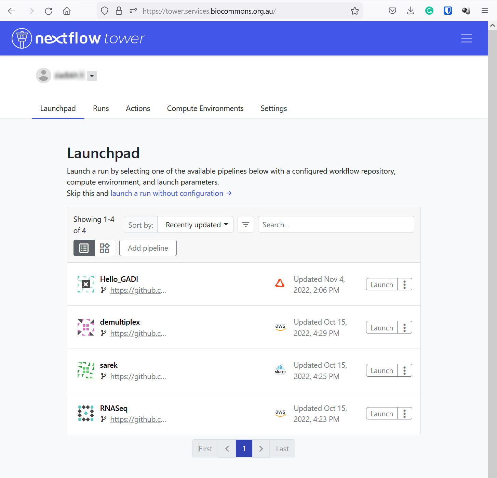

## Logging into the service

1. Go to [https://tower.services.biocommons.org.au](https://tower.services.biocommons.org.au).

2. Provide an email address. You will then receive an email with an access link.

3. Click the `Workspace` dropdown menu to navigate between your workspaces. This drop down menu can be found at the top left of the Tower landing page, next to your user name. 

